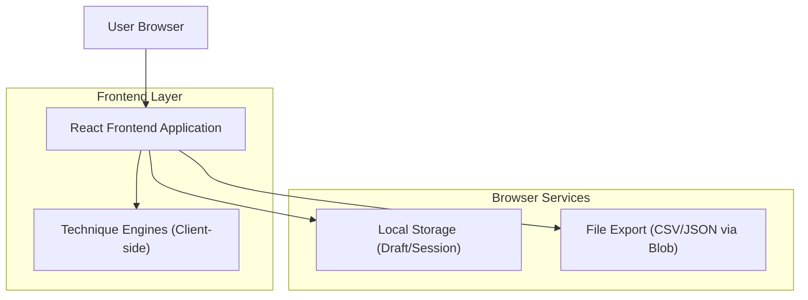

## 1.Architecture design

## 2.Technology Description
- Frontend: React@18 + TypeScript + vite
- UI: tailwindcss@3
- Routing: react-router-dom@6 (1 rota principal)
- Form/validation (recomendado): react-hook-form + zod (validação do passo 1–3 antes de gerar)
- Backend: None

## 3.Route definitions
| Route | Purpose |
|---|---|
| / | Assistente em 4 passos: entrada → técnicas → configuração → revisão/deduplicação/exportação |

## 6.Data model(if applicable)
Não aplicável (sem banco). Persistência opcional apenas de rascunho/sessão via Local Storage.
