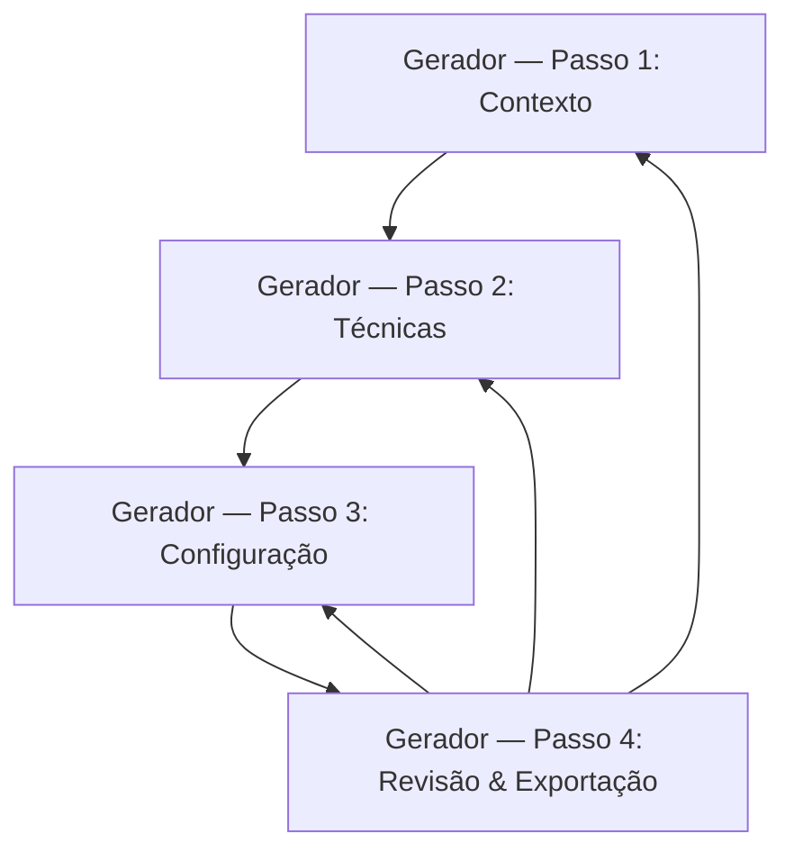

## 1. Product Overview
App web para gerar casos de teste a partir de técnicas de caixa preta, guiado por um assistente em 4 passos.
Você seleciona técnicas, configura parâmetros por técnica, o sistema combina os resultados sem duplicar e permite exportar.

## 2. Core Features

### 2.1 Feature Module
Nossa solução é composta pelas seguintes páginas principais:
1. **Gerador (Assistente em 4 passos)**: entrada do contexto, seleção de técnicas, configuração por técnica, geração/revisão e exportação.

### 2.3 Page Details
| Page Name | Module Name | Feature description |
|---|---|---|
| Gerador (Assistente em 4 passos) | Cabeçalho & Navegação | Exibir nome do app e ações básicas (reiniciar fluxo, voltar/avançar) e indicador de etapa. |
| Gerador (Assistente em 4 passos) | Passo 1 — Contexto do teste | Capturar informações mínimas do alvo (nome da funcionalidade, descrição/objetivo, entradas/saídas esperadas, restrições e premissas) para orientar a geração. |
| Gerador (Assistente em 4 passos) | Passo 2 — Seleção de técnicas | Selecionar 1+ técnicas de caixa preta e apresentar descrição curta do que cada técnica produz. |
| Gerador (Assistente em 4 passos) | Passo 3 — Configuração por técnica | Configurar parâmetros específicos por técnica (ex.: classes válidas/ inválidas, limites, condições e ações) e validar campos obrigatórios antes de gerar. |
| Gerador (Assistente em 4 passos) | Passo 4 — Gerar, combinar e deduplicar | Gerar casos de teste por técnica usando um “motor” por técnica e combinar em uma lista única sem duplicar (por similaridade/identidade de objetivo + pré-condições + passos + resultado esperado). |
| Gerador (Assistente em 4 passos) | Revisão de casos de teste | Visualizar lista (tabela) com filtros básicos (técnica/origem), editar texto (título, pré-condições, passos, resultado esperado) e remover itens. |
| Gerador (Assistente em 4 passos) | Exportação | Exportar os casos revisados para arquivo (download) em formatos: CSV e JSON (mínimo). |
| Gerador (Assistente em 4 passos) | Mensagens de estado/erro | Informar progresso (gerando, deduplicando, exportando) e erros de validação de entrada/configuração. |

## 3. Core Process
**Fluxo do usuário (único):**
1) Você abre o gerador e preenche o **Contexto** (Passo 1).
2) Você escolhe as **técnicas** aplicáveis (Passo 2).
3) Você ajusta **parâmetros por técnica** (Passo 3).
4) Você clica em **Gerar**; o app executa o motor de cada técnica, **combina sem duplicar**, permite **revisar/editar** e então **exportar** (Passo 4).

